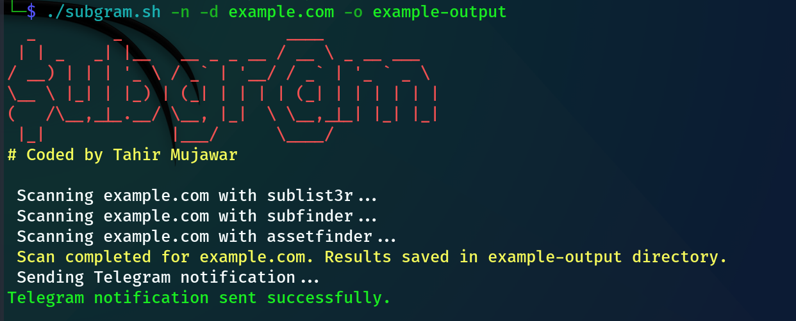

# subgram

Subgram streamlines subdomain enumeration by leveraging multiple tools to scan specified domains, ensuring comprehensive results. It includes integration with sublist3r, subfinder, and assetfinder, providing detailed reports and optional Telegram notifications upon completion.


## Features




- **Subdomain Enumeration :** Utilizes sublist3r, subfinder, and assetfinder tools to discover subdomains.
- **Telegram Notification :** Sends a notification to Telegram with details of completed enumeration.
- **Customizable :** Allows users to specify whether to receive notifications and the domain for enumeration.


## Prerequisites
- Ensure you have the necessary tools installed (sublist3r, subfinder, assetfinder).
- Obtain a Telegram Bot token and chat ID to enable notifications.

## Set up Telegram Bot

 **1. Create a Telegram Bot**
- Start a conversation with BotFather on Telegram.
- Use the /newbot command to create a new bot and follow the prompts to set up its name and username.
- Retrieve the bot token provided by BotFather for authentication purposes.

**2. Obtain Your Chat ID**

- Initiate a conversation with your newly created bot on Telegram.
- Send a message to the bot to initiate the chat.
- Visit https://api.telegram.org/bot<YourBOTToken>/getUpdates in your web browser to retrieve your chat ID.
 
**3. Integrate Telegram Notifications in the Script**

- Replace "your_bot_token" and "your_chat_id" placeholders in the Bash script with your actual bot token and chat ID.
- This enables the script to send notifications upon completion of subdomain enumeration.


## Installation


```bash
  git clone https://github.com/TheFellowHacker/subgram.git
  cd subgram
  chmod +x subgram
  ./subgram.sh -h
```
    
## Usage

```bash
./subgram.sh -h
                               
Usage: ./subgram.sh -d DOMAIN [-n] [-o OUTPUT_DIR]
Options:
  -d DOMAIN           Domain name for subdomain enumeration
  -n                  Enable Telegram notification (default: no)
  -o OUTPUT_DIR       Specify output directory (default: 'subgram_output')
  -h                  Display this help message


Example: ./subgram.sh -d example.com -n -o /path/to/output/directory
```


## 🔗 Links
Follow me on 


<p align="center">
  <a href="https://www.linkedin.com/in/thefellowhacker"></a>
  <a href="https://medium.com/@thefellowhacker"></a>
  <a href="https://twitter.com/thefellowhacker"></a>
</p>
Made with ❤️ by Tahir Mujawar

